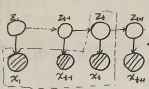
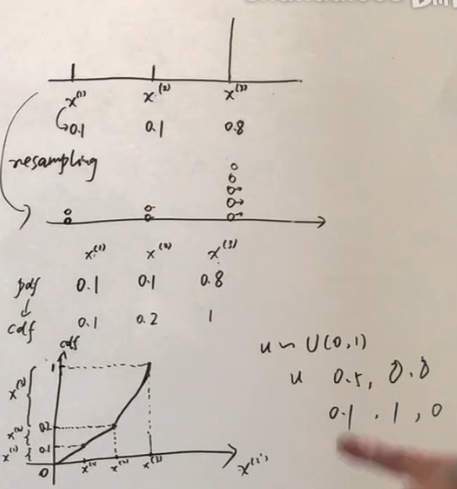

[toc]
# 背景

多数的动态系统可由上图表示
- Dynamic model
  - **HMM** 关注 decoding 问题
  - **Linear Dynamic system(Kalman Filter)** 关注 filtering 问题
  - **Non-linear, Non-Gauss(Particle Filter)** 关注filtering 问题
  - **两个重要假设**
    - 齐次 Markov 假设
    - 观测独立假设
  - Particle Filter
  $$
\begin{aligned}
  z_t = g(z_{t-1}, u, \varepsilon)\\
  x_t = g(x_{t-1}, u, \delta)
  \end{aligned}
  $$
-  Filtering 问题 也即是 求解 $p(z_t|x_1, \cdots, x_t)$
   -  step 1: prediction(求出 $z_t$ 的一个先验)
$$
p(z_t|x_1, \cdots, x_{t-1}) = \int p(z_t|z_{t-1}) p(z_{t-1}|x_1, \cdots, x_{t-1})d z_{t-1}
$$
   -  step 2: update(求出$z_t$ 的后验)
$$
p(z_t|x_1, \cdots, x_t) \propto p(x_t|z_t) p(z_t| x_1, \cdots, x_{t-1})
$$
## 重要性采样(Importance Sampling)
### 重要性采样一般步骤
(1) 对于一个求解关于$q(z)$分布期望的问题，我们做如下变换
$$E[f(z)] = \int f(z)p(z) dz = \int f(z) \frac{p(z)}{q(z)}q(z)dz$$
其中 $q(z)$ 为 proposed distribution，是一个较为简单的分布。
(2) 我们从 $q(z)$ 中采样出 $N$ 个样本，
$$
z^{(i)} \sim q(z), i=1, \cdots, N
$$
即可获取$E[f(z)]$ 的估计
$$
E[f(z)] \approx \frac{1}{N} \sum_{i=1}^N f(z^{(i)})\frac{p(z^{(i)})}{q(z^{(i)})}, 其中 \frac{p(z^{(i)})}{q(z^{(i)})} 记为 w^{(i)}，称为样本 z^{(i)} 的权重
$$
**主要存在的问题**
对于 **Filter问题** 需要求出关于 $p(z_t|x_1, \cdots, x_t)$ 的期望， 相应的$w_t^{(i)} = \frac{p(z_t^{(i)}|x_1, \cdots, x_t)}{q(z_t^{(i)}|x_1, \cdots, x_t)}$
对于每个时刻 $t$ 都需要采集 $N$ 个样本,计算对应 $N$ 个 $w_t$,但是由于 $p(z_t^{(i)}|x_1, \cdots, x_t)$ 较为难求，如此每个时刻都计算对应的$N$ 个 $w_{t}$, 计算量较为繁重。如果能找出 t-1 时刻 N 个 w 与 t 时刻 N 个 w的递推关系，就可以简化计算。
## Sequential Importance Sampling(SIS)
$$
\begin{aligned}
&**疑问**\\
&w_t \propto \frac{p(z_1, \cdots, z_t |x_1, \cdots, x_t)}{q(z_1, \cdots, z_t|x_1, \cdots, x_t)}\\
&对于分子\\
&p(z_1, \cdots, z_t |x_1, \cdots, x_t) = \frac{p(z_1, \cdots, z_t ,x_1, \cdots, x_t)}{p(x_1, \cdots, x_t)} \\
&= \frac{1}{p(x_1, \cdots, x_t)} p(z_1, \cdots, z_t ,x_1, \cdots, x_t) \\
&=\frac{1}{c} p(z_1, \cdots, z_t ,x_1, \cdots, x_t)\\
&=\frac{1}{c} p(x_{t} |z_1, \cdots, z_{t}, x_1, \cdots, x_{t-1}) p(z_1, \cdots, z_{t}, x_1, \cdots, x_{t-1})\\
& 由观测独立假设\\
&=\frac{1}{c} p(x_{t} | z_{t}) p(z_1, \cdots, z_{t}, x_1, \cdots, x_{t-1})\\
&=\frac{1}{c} p(x_{t} | z_{t}) p(z_t | z_1, \cdots, z_{t-1}, x_1, \cdots, x_{t-1}) p(z_1, \cdots, z_{t-1}, x_1, \cdots, x_{t-1})\\
& 由齐次马尔科夫假设\\
&=\frac{1}{c} p(x_{t} | z_{t}) p(z_t | z_{t-1}) p(z_1, \cdots, z_{t-1}, x_1, \cdots, x_{t-1})\\
&=\frac{1}{c} p(x_{t} | z_{t}) p(z_t | z_{t-1}) p(z_1, \cdots, z_{t-1}| x_1, \cdots, x_{t-1}) p(x_1, \cdots, x_{t-1})\\
&=\frac{d}{c} p(x_{t} | z_{t}) p(z_t | z_{t-1}) p(z_1, \cdots, z_{t-1}| x_1, \cdots, x_{t-1})\\
& 假定 q(z_1, \cdots, z_t |x_1, \cdots, x_t) = q(z_t |z_1, \cdots, z_{t-1},x_1, \cdots, x_t) q(z_1, \cdots, z_{t-1}|x_1, \cdots, x_{t-1})\\
& w_t \propto  \frac{ \frac{d}{c} p(x_{t} | z_{t}) p(z_t | z_{t-1}) p(z_1, \cdots, z_{t-1}| x_1, \cdots, x_{t-1})}{ q(z_t |z_1, \cdots, z_{t-1},x_1, \cdots, x_t) q(z_1, \cdots, z_{t-1}|x_1, \cdots, x_{t-1})} \\
& = \frac{ \frac{d}{c} p(x_{t} | z_{t}) p(z_t | z_{t-1}) }{ q(z_t |z_1, \cdots, z_{t-1},x_1, \cdots, x_t) q(z_1, \cdots, z_{t-1}|x_1, \cdots, x_{t-1})} \frac{p(z_1, \cdots, z_{t-1}| x_1, \cdots, x_{t-1})}{q(z_1, \cdots, z_{t-1}|x_1, \cdots, x_{t-1})}\\
& \propto \frac{ p(x_{t} | z_{t}) p(z_t | z_{t-1}) }{ q(z_t |z_1, \cdots, z_{t-1},x_1, \cdots, x_t) } w_{t-1}\\
& 由此，求出了w_t 与 w_{t-1} 之间的关系，可以通过前一时刻的w 计算当前的w,节约了计算量。\\
\end{aligned}
$$
### Sequential Importance Sampling 算法流程
由前节推导可知
$$
\begin{aligned}
w_t \propto \frac{ p(x_{t} | z_{t}) p(z_t | z_{t-1}) }{ q(z_t |z_1, \cdots, z_{t-1},x_1, \cdots, x_t) }  w_{t-1} \\
w_t \propto \frac{ p(x_{t} | z_{t}) p(z_t | z_{t-1}) }{ q(z_t | z_{t-1},x_1, \cdots, x_t) }  w_{t-1} \\
\end{aligned}
$$
$$
\begin{aligned}
& 假设 t-1 时刻 已经采样完成，即 w_{t-1}^{(i)} 已知\\
& t 时刻:\\
& \qquad for\quad i=1, \cdots N:\\
& \qquad \qquad 采样 z_{t}^{(i)} \sim q(z_t|z_{t-1}, x_1, \cdots, x_{t-1})\\
& \qquad \qquad 权重 w_{t}^{(i)} \sim \frac{ p(x_{t} | z_{t}) p(z_t | z_{t-1}) }{ q(z_t | z_{t-1},x_1, \cdots, x_t) }  w_{t-1}^{(i)}\\
& 对 w_{t}^{(i)} 归一化， 即 \sum_{i=1}^{N} \hat{w}_{t}^{(i)} = 1\\
\end{aligned}
$$
但是上面的算法存在权值退化问题，即少量分样本的权重趋向于 1， 大量样本权重趋向于 0. 主要原因是高维空间的维度灾难，少量样本难以代表高维空间的样本分布。增加样本数量使计算量指数增大，难以实际应用。主要解决办法如下：
- Resampling
  - 首先使用样本本身的权重值作为概率构建离散概率分布，然后使用该离散概率分布作为第二次采样的分布，可得新的采样样本。此时所有的样本权重相同均为$\frac{1}{N}$（**与单次采样有什么不同？**）

- 选择合适的 q(z)
若取$q(z_t|z_1, \cdots, z_{t-1}, x_1, \cdots, x_t) = p(z_t|z_{t-1})$, 则
$$
\begin{aligned}
& w_t \propto \frac{ p(x_{t} | z_{t}) p(z_t | z_{t-1}) }{ q(z_t | z_{t-1},x_1, \cdots, x_t) }  w_{t-1} \\
& \Rightarrow \frac{ p(x_{t} | z_{t}) p(z_t | z_{t-1}) }{ p(z_t|z_{t-1}) }  w_{t-1} \\
& \Rightarrow p(x_{t} | z_{t})  w_{t-1} \\
& 直观解释，也即是：如果当前采集的样本z_t 使得观测变量更大概率出现，那么，我们应该增加它的权重；反之，减少它的权重。使得样本分布更符合观测。\\
& 一般把上述改进算法叫做 SIR Filter(Sampling-Importance-Resampling Filter)
\end{aligned}
$$
- generate and test:
  -  generate: 采样
  -  test: 样本权重生成
**SIS + Resampling = Basic Particle Filter**
**SIS + Resampling + {$q(z) = p(z_t|z_{t-1})$} = Sampling-Importance-Resampling Filter**