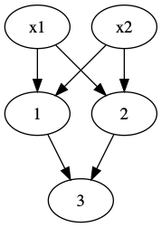

[toc]
# 前馈神经网络
## 背景
- 频率派 (统计机器学习)
  - 正则化
在旧的模型上进行改进.
  - 核化
Kernel SVM
  - 集成化
AdaBoost, Random Forest
  - 层次化
    - 神经网络(Neural Network)
      - Deep Neural Network
        - MLP (Multitayer Perception)
        - Autoencoder
        - CNN
        - RNN
- 贝叶斯派 (概率图模型)
  - 有向图模型 (贝叶斯模型)
    - Deep Directed Network
      - Sigmoid Belief Network
      - Variational Autoencoder (VAE)
      - 生成对抗网络 GAN
  - 无向图模型 (马尔科夫网络)
    - Deep Boltzman Machine
  - 有向+无向 (Mixed Network)
    - Deep Belief Network
- Deep Learning
  - Deep Neural Network
  - Deep Generation Model
    - Deep Directed Network
  - Deep Boltzman Machine
  - Deep Belief Network
## 从感知机到深度学习
### 历史
- (提出) 1958 PLA
- (衰弱) 1969 PLA has limitation
  - 解决不了 Non-linear
  - XOR Problem
- (兴起) 1981 MLP
- (兴起) 1986 BP + MLP
  - RNN 循环神经网络
- (衰弱) 1989 Universal Apposination Theorem
  - CNN 卷积神经网络
  - 大于 1 hidden layer ---> 连续函数
  - 1 layer is good ---> Why use Deep?
  - BP ---> 梯度消失
- (衰弱) SVM + kernel + theory, AdaBoost, RandForest 1993-1995
- (兴起) Deep Learning 2006
  - Deep Belief Network <---> RBM
  - Deep Autoencoder
- (兴起) GPU 2009
- (兴起) Speech 2011
- (兴起) ImageNet 2012
- (兴起) VAE 2013
- (兴起) GAN 2014
- (兴起) AlphaGo 2016
- (兴起) GNN 2018
### 发展起来原因
#### 数据量增大
#### 分布式
#### 硬件GPU
## Non-Linear Problem
### Solution
#### 手动进行非线性转换：Non-Transformation
$$
\phi : \underbrace{\mathcal{X}}_{\text{input space}} \Longrightarrow \underbrace{\mathcal{Z}}_{\text{feature space}}
$$
#### Kernel Method
$$
K \left( x, x' \right) = \left\langle \phi \left( x \right), \phi \left( x' \right) \right\rangle
$$
隐藏了一个 $\phi$, $x, x' \in \mathcal{X}$.
#### 前馈神经网络
$x_{1} \oplus x_{2} = \underbrace{\underbrace{\left( \neg x_{1} \wedge x_{2}\right)}_{1} \vee \underbrace{\left(x_{1} \wedge \neg x_{2}\right)}_{2}}_{3}$
复合运算 --> 复合表达式 --> 复合函数

**神经网络本质上为复合函数.**

##### 万能近似定理（universal approximation theorrm）
具体来说，万能近似定理（universal approximation theorem）(Hornik et al., 1989;Cybenko, 1989) 表明，一个前馈神经网络如果具有线性输出层和至少一层具有任何一种‘‘挤压’’ 性质的激活函数（例如logistic sigmoid激活函数）的隐藏层，只要给予网络足够数量的隐藏单元，它可以以任意的精度来近似任何从一个有限维空间到另一个有限维空间的Borel可测函数。

万能近似定理意味着无论我们试图学习什么函数，我们知道一个大的MLP 一定能够表示这个函数。然而，我们不能保证训练算法能够学得这个函数。即使MLP能够表示该函数，学习也可能因两个不同的原因而失败。

   1. 用于训练的优化算法可能找不到用于期望函数的参数值。
   2. 训练算法可能由于过拟合而选择了错误的函数。

根据 ‘没有免费的午餐’ 定理，说明了没有普遍优越的机器学习算法。前馈网络提供了表示函数的万能系统，在这种意义上，给定一个函数，存在一个前馈网络能够近似该函数。但不存在万能的过程既能够验证训练集上的特殊样本，又能够选择一个函数来扩展到训练集上没有的点。

总之，具有单层的前馈网络足以表示任何函数，但是网络层可能大得不可实现，并且可能无法正确地学习和泛化。 ~在很多情况下，使用更深的模型能够减少表示期望函数所需的单元的数量，并且可以减少泛化误差。~

引自 https://blog.csdn.net/guoyunfei20/article/details/78288271

