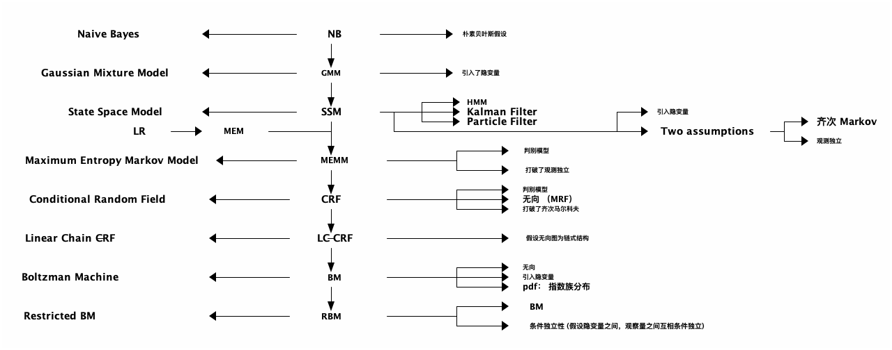

# 受限的玻尔兹曼机(RBM)
## 背景
Boltzman Machine(玻尔兹曼机): Markov RandomField with hidden nodes.

### 玻尔兹曼模型定义  
一个无向概率图模型中势函数取指数族分布，那么该模型为玻尔兹曼机，所服从的分布被称为 玻尔兹曼分布（Gibbs 分布）。

玻尔兹曼机因子分解:
$$
\begin{aligned}
P \left( x \right) &= \frac{1}{Z} \prod\limits_{ i=1 }^ { K }  \varphi \left( x_{c_i} \right)\\
&= \frac{1}{Z} \prod\limits_{ i=1 }^ { K } \exp \left\{ - E \left( x_{c_i} \right) \right\}\\
&= \frac{1}{Z} exp \left\{ - \sum\limits_{i=1}^K E \left( x_{c_i} \right) \right\}
\end{aligned}
$$
其中 $P(x) = \frac{1}{Z} \exp \left\{ -E \left( x \right) \right\}$ 为玻尔兹曼分布（Gibbs 分布）。

#### 玻尔兹曼分布
**玻尔兹曼分布最早来源于统计物理学.**
一个物理系统(包含多个粒子, 电子或原子)状态会如下公式所示:
$$
P \left( state \right) \propto \exp \left\{ - \frac{E}{k\cdot T} \right\}
$$
其中 $E$ 表示系统的能量函数.

### 概率图模型总结

#### 概率图模型的五大特点
1. 方向 (有向/无向)  ----- 边
2. 离散/连续/混合 ----- 点
3. 条件独立性强弱 (各种条件独立性假设) ----- 边
4. 隐变量 (是否包含隐变量) ----- 点
5. 概率密度函数 （是否是指数族分布) ----- 结构

## 核心思想
Boltzman Machine 难点在于 Inference, 精确推断 untrackable, 近似推断计算量又过于巨大。因此，我们将其简化, 假设h, v 之间有连接， h,v 内部无连接。
$$
\begin{aligned}
X &= \left (
\begin{array}{c}
x_{1} \\
x_2 \\
\dots \\
x_p
\end{array}
\right )  = \left (
\begin{array}{c}
h \\
v \\
\end{array}
\right ),
h = \left (
\begin{array}{c}
h_{1} \\
h_2 \\
... \\
h_m
\end{array}
\right )
,  v = \left (
\begin{array}{c}
v_{1} \\
v_2 \\
... \\
v_n
\end{array}
\right )
, m+n = p
\end{aligned}
$$
基于以上假设，可以简化 $p \left( x \right)$:
$$
\begin{aligned}
p \left( x \right) &= \frac{1}{Z} \exp \left\{ - E \left( x \right) \right\}\\
p \left( v, h \right) &= \frac{1}{Z} \exp \left\{ -E \left( v, h \right) \right\}\\
&= \frac{1}{Z} \exp \left\{ h^T w v + \alpha^T v + \beta^T h \right\}\\
&= \frac{1}{Z} \exp \left\{ h^T w v \right\} \exp \left( \alpha^T v \right) \exp \left ( \beta^T h \right )\\
\end{aligned}
$$
其中 $E \left( v, h \right) = - \left( h^T w v + \alpha^T v + \beta^T h \right)$ .

## RBM-Representation
$$
\begin{aligned}
\text{RBM's pdf } \rightarrow p \left( x \right) &= p \left( v, h \right) = \frac{1}{Z} \exp \left( h^T w v \right) \exp \left( \alpha^T v \right)\\
&= \frac{1}{Z} \prod\limits_{ i=1 }^ { m } \prod\limits_{ j=1 }^ { n } \exp \left( h_i w_{ij} v_j \right) \prod\limits_{ j=1 }^ { n } \exp \left( \alpha_j v_j\right) \prod\limits_{ i=1 }^ { m } \exp \left( \beta_i h_i \right)
\end{aligned}
$$
## RBM-Inference
#### 分解能量函数
$$
\begin{aligned}
E \left( h, v \right) &= - \left( \underbrace{\sum\limits_{i=1, i \neq l}^m \sum\limits_{j=1}^n h_i w_{ij} v_j}_{\Delta_1} + \underbrace{h_l \sum\limits_{j=1}^n w_{lj} v_j}_{\Delta_2} + \underbrace{\sum\limits_{j=1}^n \alpha_j v_j}_{\Delta_3} + \underbrace{\sum\limits_{i=1, i \neq l}^{n} \beta_i h_i}_{\Delta_4} + \underbrace{\beta_l h_l}_{\Delta_{5}} \right)\\
\Delta_2 + \Delta_5 &= h_l \left( \sum\limits_{j=1}^h w_{lj} v_j + \beta_l \right) = h_l \cdot H_l (v)\\
\bar{H} \left( h_t, v \right) &= \Delta_1 + \Delta_3 + \Delta_4\\
\therefore E \left( h, v \right) &= h_l \cdot H_l \left( v \right) + \bar{H}_l \left( h_{-l}, v \right)
\end{aligned}
$$
#### 推导 $p \left( h_l | v \right)$ 与 $p \left( v_l | h \right)$
设 $h_l \in \left\{ 0,1 \right\}$,
$$
\begin{aligned}
p \left( h_l = 1| v \right) &= p \left( h_l = 1 | h_{-l}, v \right) \\ 
&= \frac {p \left( h_l = 1 , h_{-l}, v \right)}{p \left( h_{-l}, v \right)}\\
&= \frac {p \left( h_l , h_{-l}, v \right)}{p \left( h_l = 0,  h_{-l}, v \right) + p \left( h_l = 1,  h_{-l}, v \right)} \\
&= \frac { \frac{1}{Z} \exp \left\{ H_l (v) + \bar{H} \left( h_{-l}, v \right) \right\} }{\frac{1}{Z} \exp \{ H_l (v) + \bar{H}_l \left( h_{-l}, v \right) \} + \frac{1}{Z} \exp \{\bar{H}_l \left( h_{-l}, v \right) \} } \\
&= \frac{1}{1+ \exp \left\{ - H_l (v) \right\} } = \sigma \left( H_l \left( v \right) \right) = \sigma \left( \sum\limits_{j=1}^n w_{lj} v_j + \beta_l  \right)
\end{aligned}
$$
$p \left( v_l | h \right)$ 同理。

#### 推导 $p(v)$
设 $h_l \in \left\{ 0,1 \right\}$,
$$
\begin{aligned}
p \left( v \right) &= \sum\limits_h P \left( h,v \right) = \sum\limits_h^{} \frac{1}{Z} \exp \left\{ -E \left( h, v \right) \right\} = \sum\limits_h^{} \frac{1}{Z} \exp \left\{ - \left( h^T W v + \alpha^T v + \beta^T h \right) \right\}\\
&= \frac{1}{Z} \sum\limits_{h_1}^{} ... \sum\limits_{h_m}^{} \exp \left\{ (h^T W v + \alpha^T v + \beta^T h) \right\}\\
&= \frac{1}{Z} \exp \left( \alpha^T v \right) \sum\limits_{h_1}^{} ... \sum\limits_{h_m}^{} \exp \left\{  h^T w v + \beta^T h \right\}\\
&= \frac{1}{Z} \exp \left( \alpha^T v \right) \sum\limits_{h_1}^{} ... \sum\limits_{h_m}^{} \exp \left\{ \sum\limits_{i=1}^m (h_i w_i v + \beta_i h_i) \right\}\\
&= \frac{1}{Z} \exp \left( \alpha^T v \right) \sum\limits_{h_1}^{} \exp \left\{ (h_1 w_1 v + \beta_1 h_1) \right\} ... \sum\limits_{h_m}^{} \exp \left\{ (h_m w_m v + \beta_m h_m) \right\}\\
&= \frac{1}{Z} \exp \left( \alpha^T v \right) (1 + \exp \left\{ w_1 v + \beta_1 \right\}) ... (1 + \exp \left\{ w_m v+ \beta_m \right\} )\\
&= \frac{1}{Z} \exp \left( \alpha^T v \right) \exp \log (1 + \exp \left\{ w_1 v + \beta_1 \right\}) ... \exp \log (1 + \exp \left\{ w_m v+ \beta_m \right\} )\\
&= \frac{1}{Z} \exp (\alpha^T v + \sum\limits_{i=1}^m \underbrace{\log \left( 1 + \exp \left( w_i v + \beta_i \right) \right)}_{softplus})\\
&= \frac{1}{Z} \exp \left( \alpha^T v + \sum\limits_{i=1}^m softplus (w_i v + \beta_i) \right)
\end{aligned}
$$
其中 $w_i$ 为 $w$ 的行向量.
## RBM 的 Learning
可以参考[xx](./直面配分函数.md)

