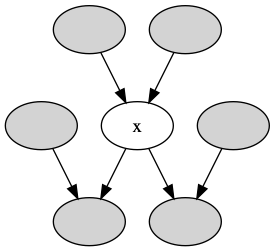
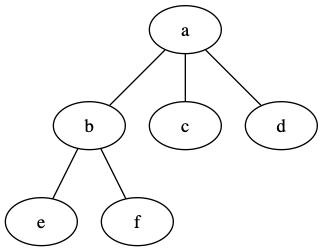
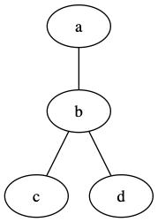
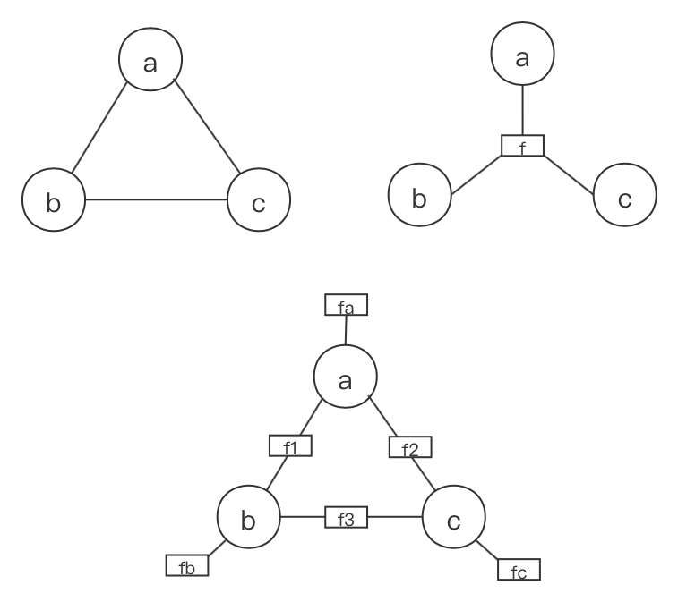

[toc]
# 概率图模型
## Representation
### 概率图模型---概率部分基础内容 
#### 高维随机变量的符号表示
高维随机变量: $P \left( x_1, x_2,... x_p \right)$
边缘概率: $P \left( x_i \right)$
条件概率: $P \left( x_j | x_i \right)$
#### 概率公式
1. Sum Rule： $P \left( x_1 \right) = \int P \left( x_1, x_2 \right) d x_2$
2. Product Rule: $P \left( x_1, x_2 \right) = P \left( x_1 \right) P \left( x_2|x_1 \right)= P \left( x_2 \right) P \left( x_1|x_2 \right)$
3. Chain Rule: $P \left( x_1, x_2, ..., x_p \right) = \prod\limits_{i=1}^p P \left( x_i | x_1,x_2,...,x_{i-1} \right)$
4. Bayesian Rule: $P \left( x_2 | x_1 \right) = \frac{P \left( x_1,x_2 \right)}{P \left( x_1 \right)} = \frac{P \left( x_1,x_2 \right)}{\int P \left( x_1,x_2 \right)d x_2} = \frac{P \left( x_2 \right) P \left( x_1|x_2 \right)}{\int P \left( x_2  \right) P \left( x_1 |x_2 \right) d x_2}$
#### 高维随机变量存在的困境
维度高，计算复杂， $P \left( x_1,x_2,...,x_p \right)$ 计算量过大。
##### 解决方案---简化运算
提出前提假设来简化运算
1. 互相独立假设
   假设高维随机变量各个维度互相独立: $P \left( x_1,x_2,...,x_p \right)= \Pi_{i=1}^p P \left( x_i \right)$ 
   典型代表模型为:朴素贝叶斯分类器 (Naive Bayes Classifier)  
   朴素贝叶斯模型: $P \left( x|y \right) = \prod\limits_{i=1}^p P \left( x_i|y \right)$
2. 马尔科夫假设
   $x_j \perp x_{i+1} | x_i, j<i$
   典型代表模型为: 隐马尔科夫模型(HMM), 其服从 **齐次马尔科夫假设** 与观测独立假设。 
3. 条件独立性假设
   马尔科夫假设的推广
   $x_A \perp x_B | x_C$,  $x_A, x_B, x_C$ 是集合，且互不相交
   典型代表模型为: 概率图模型。
以上假设程度依次递减。 
### 有向无环概率图模型---贝叶斯网络 (Bayesian Network)
#### 概率公式
链式法则: $P \left( x_1,x_2,...x_p \right)= P \left( x_1 \right) \prod\limits_{ i=2 }^ { p } P \left( x_i|x_1,...,x_{i-1} \right)$
条件独立性: $x_A \perp x_B | x_C$,  $x_A, x_B, x_C$ 是集合，且互不相交
#### 因子分解
$P \left( x_1,x_2,...,x_p \right)= \prod\limits_{ i=1 }^ { p } P \left( x_i | x_{pa \left( i \right)} \right)$, 其中 $x_{pa \left( i \right)}$ 为 $x_i$ 的父集合。
#### 条件独立性
##### 局部马尔科夫性(Local Markov Property)-有向无环概率图中的三种基本结构
###### Tail to tail

通过因子分解可以得出: $P \left( a,b,c \right)= P \left( a \right) P \left( b|a \right) P \left( c|a \right)$ 
通过链式法则可以得出: $P \left( a,b,c \right) = P \left( a \right) P \left( b|a \right) P \left( c|a,b \right)$
进而可以推导出: $P(c|a) = P(c|a,b)$, 因此 $c \perp b | a$

在因子分解的基础之上也可以推导出 $P \left( b,c|a \right) = P \left( b|a \right) P \left( c|a \right)$:
$$
\begin{aligned}
P \left( a,b,c \right)&= P \left( a \right) P \left( b|a \right) P \left( c|a \right)\\
\frac{P \left( a,b,c \right)}{P \left( a \right)} &=  P \left( b | a\right) P \left( c|a \right)\\
P \left( b,c | a\right)&=  P \left( b | a\right) P \left( c|a \right)
\end{aligned}
$$

**若a被观察，b与c直接的路径阻塞，b与c互相独立**

###### Head to tail

通过因子分解可以得出: $P \left( a,b,c \right)= P \left( a \right) P \left( b|a \right) P \left( c| b \right)$ 
通过链式法则可以得出: $P \left( a,b,c \right) = P \left( a \right) P \left( b|a \right) P \left( c|a,b \right)$
进而可以推导出: $P(c|b) = P(c|a,b)$, 因此 $a \perp c | b$

在因子分解的基础之上也可以推导出 $P \left( a,c|b \right) = P \left( a|b \right) P \left( c|b \right)$:
$$
\begin{aligned}
P \left( a,b,c \right)&= P \left( a \right) P \left( b|a \right) P \left( c|a \right)\\
\frac{P \left( a,b,c \right)}{P \left( b \right)} &= \frac{ P \left( a  b\right) P \left( c|b \right)} {P \left( b \right)}\\
P \left( a,c | b\right)&=  P \left( a | b\right) P \left( c|a \right)
\end{aligned}
$$
**若b被观察，a与c直接的路径阻塞，a与c互相独立**

###### Head to head

通过因子分解可以得出: $P \left( a,b,c \right)=P \left( a \right) P \left( b \right) P \left( c|a,b \right)$ 
通过链式法则可以得出: $P \left( a,b,c \right) = P \left( a \right) P \left( b|a \right) P \left( c|a,b \right)$
进而可以推导出: $P(b) = P(b|a)$

**默认情况下, a与b之间的路径是阻塞的，也就是a与b独立.**
**当c被观察的情况下, a与b之间连通，也就是a与b不在独立.**
###### 总结
满足以上性质则称其满足局部马尔科夫性.
##### 全局马尔科夫性(Global Markov Property)-有向分离((D-Separation,D划分)
如果集合B阻塞A到C中的任何一条通路（path），则称在这个有向无环图（Directed Acyclic Graph）里，集合B有向分离A和C。也称B为A和C的切割集。

如果一个路径不是有向分离的，则称其为有向连接的（D-connected）.
###### 阻塞（Block）
设A，B，C分别是一个有向无环图（Directed Acyclic Graph）G里互没有交集的节点集（set），B阻塞A中的任一个节点到C中的任一个节点的通路（B blocks every paths from a node in A to a node in C），当且仅当节点集Z满足如下条件：

1. 如果G中有顺连结构 a—>b—>c 或分连结构 a<—b—>c, 其中节点a与节点b分别在在集合A与C中，则节点b包含在集合B中；
2. 如果G中有汇连结构 a—>b<—c，其中节点a与节点b分别在在集合A与C中, 则节点b及其后裔节点（descendants）一定不包含在集合B中。
###### 总结
**D-Separation 将上节中讲的有向无环概率图中的三种基本结构由局部拓展到了整体, 由单个随机变量拓展到了随机变量集合。**
符合 D-Separation 的集合称其满足 全局马尔科夫性。
##### 总结
因子分解与条件独立性等价。
#### 马尔科夫毯
$x_i$ 的条件概率公式如下:
$$
\begin{aligned}
P \left( x_i | x_{-i} \right) &= \frac{P \left( x_i, x_{-i} \right)}{P \left( x_{-i} \right)} \\
&= \frac{P \left( x \right)}{ \int_{x_i} P \left( x \right) d x_i} \\
&= \frac{ \prod\limits_{ j=1 }^ { p } P \left( x_j | x_{pa \left( j \right)} \right) }{\int_{x_i} \prod\limits_{ j=1 }^ { p }  P \left( x_j | x_{pa (j)}\right)d x_i}\\
&= \frac{ P \left( x_i|x_{pa(i)} \right)P \left( x_{child(i)} | x_i, x_{parent(child(i))} \right)}{\int P \left( x_i|x_{pa(i)} \right)P \left( x_{child(i)} | x_i, x_{parent(child(i))} \right) dx_i}
\end{aligned}
$$
其表示了计算某个节点的条件概率仅仅依赖于这个节点的父节点，子节点，以及子节点的所有父节点。
其结构如下图所示:

该种结构称作马尔科夫毯 (Markov Blanket).
##### 总结
**也就是说在满足马尔科夫性质的有向无环图中,每个节点与所有节点的关系等价于每个节点与其父节点，子节点，以及子节点的所有父节点的关系.**
- 具体模型分类
  - 单一模型
    - 朴素贝叶斯分类器 (Naive Bayes Classifier)
  - 混合模型
    - 高斯混合模型 (GMM)
  - 时间模型
    - Markov Chain
    - Gaussian Process (无限维高斯分布)
  - 连续模型
    - Gaussian Bayesian Network
  - 动态模型
    - 混合模型 
    - 时间模型 
      - 隐马尔科夫模型 (HMM) 隐变量要求是离散的
      - 线性动态系统 LDS
        - Kalman Filter(卡曼滤波) 连续(Gaussian)，线性的
        - Particle Filter(粒子滤波) 非高斯，非线性
##### 总结
1. **从单一到混合**
2. **从有限到无限**
   1. 空间 (离散 -> 连续)
   2. 时间
### 无向概率图模型---马尔科夫网络 Markov Network (马尔科夫随机场, Markov Random Field)
#### 条件独立性
条件独立体现在以下三个方面, 以下三个方面互相等价。
##### 全局马尔科夫性(Global Markov Property)
1$x_A \perp x_C | x_B$
如果集合B阻塞A到C中的任何一条通路，则称在这个无向图里，集合B有向分离A和C。也称B为A和C的切割集。
###### 阻塞（Block）
设A，B，C分别是一个无向图 G 里互没有交集的节点集（set），B阻塞A中的任一个节点到C中的任一个节点的通路，当且仅当节点集Z满足如下条件：

如果G中节点a与节点c连通，其中节点a与节点c分别在在集合A与C中，则节点a到节点c所有路径上必须都存在一个节点b，其包含在集合B中。
##### 局部马尔科夫性(Local Markov Property)
$a \perp$ {全集-a的邻居} | 邻居

在上图的例子中, $a \perp \{e,f\}|\left\{ b,c,d \right\}$
##### 成对马尔科夫性
$x_i \perp x_j | x_{-i-j},\quad i \neq j$, 并且 $i$ 与 $j$ 之间没有边直接相连
#### 因子分解
$$
\begin{aligned}
P \left( x \right) &= \frac{1}{Z} \prod\limits_{ i=1 }^ { K }  \varphi \left( x_{c_i} \right)\\ 
Z &= \sum\limits_{x} \prod\limits_{ i=1 }^ { K } \varphi \left( x_{c_i} \right) \\
&= \sum\limits_{ x_{1} } \sum\limits_{ x_{2} }... \sum\limits_{ x_{p} } \prod\limits_{ i=1 }^ { K } \varphi \left( x_{c_i} \right) \\  
\end{aligned}
$$
其中 $x_{c_i}$ 表示最大团 $c_i$ 中随机变量的集合, $Z$ 为归一化因子, $\varphi \left( x_{c_i} \right)$ 为势函数，必须为正. 

最大团之间是没有边连接的, 互相独立,所以是连乘。
##### Hammesley-clifford 定理 (Markov Random Field 核心难点在此证明)
基于最大团的因子分解 等价于 满足马尔科夫性(条件独立中的三种马尔科夫性)
##### 势函数
来自统计物理，热力学中的定义
$$
\begin{aligned}
&\varphi \left( x_{c_i} \right) = \exp \left\{ -E \left( x_{c_i} \right) \right\}\\
&E \left( x_{c_i} \right) \text { is energy function.}
\end{aligned}
$$

$$
\begin{aligned}
P \left( x \right) &= \frac{1}{Z} \prod\limits_{ i=1 }^ { K }  \varphi \left( x_{c_i} \right)\\
&= \frac{1}{Z} \prod\limits_{ i=1 }^ { K } \exp \left\{ - E \left( x_{c_i} \right) \right\}\\
&= \frac{1}{Z} exp \left\{ - \sum\limits_{i=1}^K E \left( x_{c_i} \right) \right\}
\end{aligned}
$$
$P \left( x \right)$ 称为 Gibbs Distribution (Boltzmann Distribution), 其满足指数族分布的一般形式 $h \left( x \right) \exp \left\{ \eta^T \phi \left( x \right) - A \left( \eta \right) \right\} = \frac{1}{Z \left( \eta \right)} h \left( x \right) \exp \left\{ \eta^T \phi \left( x \right) \right\}$, 因此 Gibbs Distribution 为 指数族分布。
###### 总结
1. Gibbs 分布本身蕴含着最大熵原理, 其也是指数族分布。
2. Markov Random Field $\Longleftrightarrow$ Gibbs Distribution。
3. Markov Random Field 符合最大熵原理。
## Inference
### Inference 目标
求概率: $P \left( x \right) = P \left( x_1, x_2,...,x_p \right)$
边缘概率: $P \left( x_i \right) = \sum\limits_{x_1}...\sum\limits_{x_i}...\sum\limits_{x_p} P\left( x \right)$ 
条件概率: $P \left( x_A | x_B \right), x = x_A \cup x_{B}$
MAP Inference: $\hat{z} = \arg\max\limits_{z} P \left( z|x \right) \propto \arg \max\limits_z P \left( z,x \right)$
### 精确推断 
#### Variable Elimination (VE)
##### 核心思想
将边缘概率的最终结果转化为:
$$
P \left( x \right) =  \sum\limits_{ x_{c} } \prod\limits_{k \in NB(c)} \phi_{k} \left( x_c \right) 
$$
##### Forward Algorithm

$$
\begin{aligned}
P \left( d \right) &= \sum\limits_{a,b,c} P \left( a,b,c,d \right)\\
& = \sum\limits_{a,b,c} P \left( a \right) P \left( b|a \right) P \left( c|b \right) P \left( d|c \right)\\
& = \sum\limits_{b,c} P \left( c|b \right) P \left( d|c \right) \sum\limits_{a} P \left( a \right) P \left( b|a \right)\\
& = \sum\limits_{c} P \left( d|c \right) \sum\limits_b P \left( c|b \right) \phi_{a} \left( b \right)\\
& = \sum\limits_{c} P \left( d|c \right) \phi_{b} \left( c \right)\\
& = \phi_c \left( d \right)
\end{aligned}
$$
##### Forward-Backward Algorithm 

$$
\begin{aligned}
P \left( c \right) &= \sum\limits_{a,b,d,e} P \left( a,b,c,d,e \right)\\
&= \left( \sum_b P(c|b) \sum_a P \left( b|a \right) P \left( a \right) \right) \left( \sum_d P \left( d|c \right) \sum_e P \left( e|d \right) \right)\\
&= \phi_b \left( c \right) \phi_d^{'} \left( c \right)
\end{aligned}
$$

##### 总结
利用乘法对假发的分配律，以简化运算。
缺点:
  1. 存在大量的重复计算
  2. 对于最优计算顺序的求解是 NP-hard 问题
#### Belief Propagation (BP) (针对树形结构)
##### 问题定义 
现存一个无向概率图模型 G , V 为图中所有点的集合，E 为图中所有边的集合 , 全概率公式如下图所示:
$$
P \left( V \right) = \frac{1}{Z} \prod\limits_{ v\in V } \varphi_{v} \prod\limits_{ e \in E } \varphi_e \left( e \right)
$$
其中 $\varphi(\cdot)$ 为势函数。
##### Sum-Product Algorithm 
###### 核心思想
通过减少重复计算的方式来优化VE算法在树结构上**边缘概率**的计算效率的运行效率

###### Belief Propagation 与边缘概率的计算
结合VE算法思想, 边缘概率可以通过如下方式计算得到:
$$
\begin{aligned}
P \left( x_i \right) &= \varphi_i \prod\limits_{ k \in NB(i) } { m_{k\rightarrow j} \left( x_i \right) }\\ 
m_{j\rightarrow i}(x_i) &= \sum\limits_{x_j}{\varphi_{ij}(x_i,x_j) \varphi_j(x_j)} \prod\limits_{ k \in NB \left( j \right)-i } m_{k\rightarrow j} \left( x_j \right)
\end{aligned}
$$
通过这种方式所有边缘概率都可以通过 $m_{i\rightarrow j}(x_j)$ 与 势函数直接计算得到。 
$m_{i\rightarrow j}(x_j)$ 为2倍边的数量，因此大幅度的简化了运算, $m_{i\rightarrow j}(x_{j})$ 可以称为 Belief Propagation. 
###### 算法流程
- BP (Sequential Implementation) 
  1. Get Root, assume a is root.
  2. Collect Message (Root)
     for $x_i$ in NB(Root), Collect Message( $x_i$ )
   Collect Root Message 
  3. Distribute Message (Root)
    Distribute Root Message 
    for $x_j$ in NB(Root), Distribute Message ( $x_j$ )
Get $m_{ij}$ for all $i,j \in V$
进而可以得到 $P \left( x_k \right), k\in V$ 
- BP (Parellel Implementation)
基于分布式的迭代算法
- 总结
时间复杂度为 $O(|E|)$
###### 举例

全概率公式计算:
$$
\begin{aligned}
& P \left( a,b,c,d \right) \\
&= \frac{1}{Z} \varphi_a \left( a \right) \varphi_b \left( b \right) \varphi_c \left( c \right) \varphi_d \left( d \right) \varphi_{a,b} \left( a,b \right) \varphi_{b,c} \left( b,c \right) \varphi_{b,d} \left( b,d \right)
\end{aligned}
$$

Belief Propagation 计算:
$$
\begin{aligned}
m_{c\rightarrow b}(x_{b}) &= \sum\limits_{x_c} \varphi_c \left( x_c \right) \varphi_{b,c} \left( x_b,x_c \right)\\
m_{a\rightarrow b}(x_{b}) &= \sum\limits_{x_a} \varphi_a \left( x_a \right) \varphi_{b,a} \left( x_b,x_a \right)\\
m_{d\rightarrow b}(x_{b}) &= \sum\limits_{x_d} \varphi_d \left( x_d \right) \varphi_{b,d} \left( x_b,x_d \right)
\end{aligned}
$$
边缘概率计算:
$$
P \left( x_b \right) = \varphi_b m_{c\rightarrow b} \left( x_b \right) m_{d \rightarrow b} \left( x_b \right) m_{a \rightarrow b} \left( x_b \right)
$$

##### Max-Product Algorithm 
###### 核心思想
1. BP的改进, BP 只能进行求概率, 而不能进行 MAP(Decoding)
2. Viterbi 的推广 (Viterbi 算法是用于HMM的算法)
###### Belief Propagation 计算
基于 BP 算法的思想，可以得到 Belief Propagation 的计算公式为.
$$
\begin{aligned}
m_{j\rightarrow i} &= \max\limits_{x_j}{\varphi_{ij}(x_i,x_j) \varphi_j(x_j)} \prod\limits_{ k \in NB \left( j \right)-i } m_{k\rightarrow j} \left( x_j \right)
\end{aligned}
$$
可以通过 $\max P \left( x_i \right) = \max\limits_{x_i} \varphi_i \prod\limits_{ k \in NB(i) } { m_{k\rightarrow j} \left( x_i \right) }$ 的方式进行 Decoding, 得到后验概率最大的情况下各个变量的取值。
###### 算法流程图
与 Sum-Product Algorithm 算法流程图类似。
#### Junction Tree Algorithm (普通图结构) 
### 近似推断
#### Loop Belief Propagation (有环图)
#### [Variational Inference](./变分推断.md)
#### Monta Carlo Inference 
##### Importance Sampling
##### 马尔可夫链蒙特卡罗方法
## Learning
### 参数学习
#### 完备数据
      - 有向图
      - 无向图
    - 隐变量
      - EM 算法
  - 结构学习
## 相关概念
### Moral Graph (道德图)
#### 核心思想
把有向图转化为无向图
#### 转化方式
##### 有向图三种基础结构的转化方式
###### tail-2-tail

$$
\begin{aligned}
P \left( a,b,c \right) &= P \left( a \right) P \left( b|a \right) P \left( c|a \right)\\
\end{aligned}
$$

由于 (a,b) 与 (a,c) 都是团结构，因此可以令：
$$
\begin{aligned}
\phi \left( a,b \right) &= P \left( a \right) P \left( b|a \right)\\
\phi \left( a, c \right) &= P \left( c | a \right)
\end{aligned}
$$
因此可以通过直接将有向边转化为无向边的方式转化为无向图。
###### head-2-tail

$$
P \left( a,b,c \right) = P \left( a \right) P \left( b|a \right) P \left( c|b \right)
$$

由于 (a,b) 与 (b,c) 都是团结构，因此可以令：
$$
\begin{aligned}
\phi \left( a, b \right) &= P \left( a \right) P \left( b|a \right)\\
\phi \left( b, c \right) &= P \left( c | b \right)
\end{aligned}
$$
因此可以通过直接将有向边转化为无向边的方式转化为无向图。

###### head-2-tail

$$
P \left( a,b,c \right) = P \left( a \right) P \left( b \right) P \left( c|a,b \right)
$$

我们令
$$
\begin{aligned}
\phi \left( a, b, c \right) &= P \left( a \right) P \left( b \right) P \left( c | a,b \right)\\
\end{aligned}
$$
然而 (a,b,c) 不是团结构， 因此我们建立一条边连接 a,b 使其变为团结构。

最终转化为如下形式

##### 标准化转化方式
1. $\forall x_i \in G$, 将 Parent ($x_i$) 两两相连。
2. 将 G 中的有向边替换为无向边
#### 性质
有向图对应的道德图划分 等价于 有向图的D-划分
### Factor Graph (因子图)
#### 因子图
$$
P \left( x \right) = \prod\limits_{ s } { f_s \left( x_s \right) } 
$$
S: 图的节点子集
$X_S$: 是 x 的随机变量子集
##### 例子

其中因子分解结果可以分别写成
$$
P(x) = f(a,b,c)
$$
$$
P(x) = f_1 \left( a,b \right) f_2 \left( a,c \right) f_3 \left( b,c \right) f_a \left( a \right) f_b \left( b \right) f_c \left( c \right)
$$
可以直观的看出得到的因子分解图是个二分图。
##### 总结
因子图可以看做对因子分解的进一步分解。

